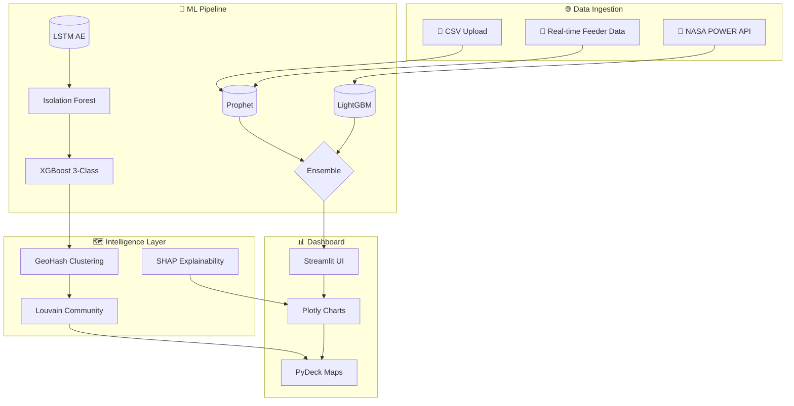

<div align="center">


<br>

[](LICENSE)
[](https://python.org)
[](https://streamlit.io)
[](https://huggingface.co/spaces/nitinmal1121212/vidyut-ai)
[](Dockerfile)

<br>

**⚡ AI-Powered Utility Intelligence for Bangalore Electricity Supply Company**

<p align="center">
  <b>Demand Forecasting</b> • <b>Theft Detection</b> • <b>Geospatial Analytics</b> • <b>Network Intelligence</b> • <b>Compliance Audit</b> • <b>Time Series Forecasting</b>
</p>

<a href="https://huggingface.co/spaces/nitinmal1121212/vidyut-ai">
  
</a>

</div>

---

<br>

<div align="center">

## 🎯 The Problem

<p align="center" width="80%">
  
</p>

```
BESCOM serves 12M+ consumers across Bangalore
├─ 30% peak demand uncertainty → grid instability
├─ ₹2,400 Cr annual revenue loss from power theft
├─ Manual audit trails → compliance gaps
└─ No real-time syndicate detection for organized theft rings
```

<br>

## 💡 Our Solution

</div>

```
┌─────────────────────────────────────────────────────────────────────┐
│                    VIDYUT INTELLIGENCE ENGINE                        │
│                         (6-Module Suite)                             │
├──────────────┬──────────────┬──────────────┬──────────────┬───────────┤
│   DEMAND     │   THEFT      │  GEOSPATIAL │    RING      │   AUDIT   │
│  FORECAST    │   ALERTS     │    MAP       │  DETECTION   │   TRAIL   │
│  Prophet+LGB │ LSTM+IsoF+XGB│   PyDeck    │   Louvain    │ Immutable │
│   Ensemble   │  3-Stage Pipe│  Heatmaps   │   Graphs     │   Logs    │
├──────────────┴──────────────┴──────────────┴──────────────┴───────────┤
│                    TIME SERIES FORECAST (Holt-Winters)                 │
└─────────────────────────────────────────────────────────────────────┘
```

---

<br>

<div align="center">

## 🛰️ Architecture Overview

</div>



---

<br>

<div align="center">

## 🔮 Six Intelligence Modules

</div>

<table>
<tr>
<td width="50%">

### 📈 Module 1: Demand Forecast


- **Multi-horizon prediction**: 12h → 30d granularity
- **NASA POWER weather integration**: Temperature, humidity, solar irradiance
- **11kV feeder-level resolution** with transformer capacity alerts
- **Load shedding early warning**: 80% / 90% / 95% / 110% thresholds

```
Input: feeder_id, timestamp, demand_kw
Output: Peak demand + capacity alert + peak hours
```

</td>
<td width="50%">

### 🚨 Module 2: Theft Alerts


- **3-Stage Detection**: LSTM Autoencoder → Isolation Forest → XGBoost
- **4 Loss Types**: Power theft / Technical loss / Billing error / Normal
- **SHAP explainability**: Feature contribution breakdown per consumer
- **Rule Engine**: R1–R6 automated flag system

```
Input: 31-day consumption profile
Output: Risk score + loss type + confidence
```

</td>
</tr>
<tr>
<td width="50%">

### 🗺️ Module 3: Geospatial Map


- **Bangalore-wide heatmap** across 8 BESCOM zones
- **3 Display modes**: Consumer pins / Theft heatmap / Zone overlay
- **Risk-colored markers**: HIGH 🔴 / MEDIUM 🟡 / LOW 🟢
- **Interactive tooltips**: Click any marker for consumer details

```
Coverage: 8 Zones | Lat/Lon: 12.97, 77.59
```

</td>
<td width="50%">

### 🔗 Module 4: Ring Detection


- **Syndicate detection** via shared transformer / geohash proximity
- **Network graph visualization**: Centroids + member nodes + edges
- **Formation timeline**: Bubble chart of ring evolution
- **Severity scoring**: Member count × anomaly ratio

```
Complexity: O(n log n) | Edges: transformer + proximity
```

</td>
</tr>
<tr>
<td width="50%">

### 📋 Module 5: Audit Trail


- **Immutable prediction logging**: Every inference stored
- **Queryable by**: Date range, alert type, confidence, model version
- **Regulatory checklist**: 9-point compliance framework
- **Export**: Audit CSV + Compliance report CSV

```
Retention: 60+ days | Schema: AUD-XXXXXX format
```

</td>
<td width="50%">

### 📉 Module 6: Time Series Forecast


- **Universal CSV/Excel upload**: Auto-detects date + numeric columns
- **Configurable**: Trend / Seasonal / Period / Horizon
- **Confidence bands**: 80% + 95% intervals
- **Accuracy metrics**: MAE, RMSE, MAPE with interpretations

```
Input: Any time series | Output: Forecast + bounds + CSV
```

</td>
</tr>
</table>

---

<br>

<div align="center">

## ⚡ Tech Stack

</div>

```python
"""
┌────────────────────────────────────────────────────────────┐
│  Frontend          │  Streamlit + Plotly + PyDeck          │
│  Forecasting       │  Prophet + LightGBM + Holt-Winters   │
│  Anomaly Detection │  LSTM (PyTorch) + Isolation Forest + XGBoost │
│  Graph Analytics   │  NetworkX + python-louvain + GeoHash   │
│  Backend API       │  FastAPI + Uvicorn                     │
│  Database          │  Neon (Serverless Postgres)            │
│  Cache             │  Upstash (Serverless Redis)            │
│  Deployment        │  Docker + Hugging Face Spaces          │
└────────────────────────────────────────────────────────────┘
"""
```

<br>

<div align="center">

| | |
|:--|:--|
|  | Interactive dashboards with zero-refresh caching |
|  | Publication-quality interactive visualizations |
|  | Deep learning for LSTM autoencoder architecture |
|  | Gradient boosting for demand forecasting ensemble |
|  | High-performance async API layer |
|  | Containerized deployment for reproducibility |

</div>

---

<br>

<div align="center">

## 🚀 Quick Start

</div>

### Local Development

```bash
# 1. Clone repository
git clone <repo-url>
cd Vidyut

# 2. Install dependencies
pip install -r requirements.txt
pip install -r requirements-ui.txt

# 3. Launch dashboard
streamlit run src/dashboard/app.py
# → Opens at http://localhost:8501
```

### Docker Deployment

```bash
# Build and run
docker build -t vidyut .
docker run -p 7860:7860 vidyut
```

### Live Demo

[](https://huggingface.co/spaces/nitinmal1121212/vidyut-ai)

> **URL**: [https://huggingface.co/spaces/nitinmal1121212/vidyut-ai](https://huggingface.co/spaces/nitinmal1121212/vidyut-ai)

---

<br>

<div align="center">

## 📊 Dashboard Preview

</div>

<div align="center">

| Demand Forecast | Theft Alerts |
|:--:|:--:|
|  |  |
| *Prophet + LightGBM ensemble with load alerts* | *LSTM → IsoF → XGB with SHAP explainability* |

| Geospatial Map | Ring Detection |
|:--:|:--:|
|  |  |
| *PyDeck heatmap across 8 BESCOM zones* | *Louvain community detection network* |

| Audit Trail | Time Series |
|:--:|:--:|
|  |  |
| *Immutable logs + regulatory checklist* | *80%/95% confidence bands + export* |

</div>

---

<br>

<div align="center">

## 📁 Repository Structure

</div>

```
Vidyut/
├── 📄 src/dashboard/
│   ├── app.py                          # Entry point + navigation
│   ├── pages/
│   │   ├── 1_Demand_Forecast.py       # Prophet + LGBM ensemble
│   │   ├── 2_Theft_Alerts.py          # 3-stage detection pipeline
│   │   ├── 3_Geospatial_Map.py        # PyDeck Bangalore heatmap
│   │   ├── 4_Ring_Detection.py        # Louvain network graphs
│   │   ├── 5_Audit_Trail.py           # Compliance logging
│   │   └── 6_Time_Series_Forecast.py  # Holt-Winters engine
│   ├── components/
│   │   └── shared.py                  # Shared functions, CSS inject
│   └── assets/
│       └── style.css                  # Dark theme + gov branding
│
├── 📄 src/api/                         # FastAPI backend
├── 📄 src/config/                      # Feature configs + zone definitions
├── 📄 src/models/                      # ML model weights + architecture
│
├── 📄 Dockerfile                       # Container definition
├── 📄 requirements.txt                 # Core Python deps
├── 📄 requirements-ui.txt              # Streamlit + Plotly + PyDeck
├── 📄 README_GITHUB.md                 # This file
└── 📄 RUN_INSTRUCTIONS.md              # Detailed feature guide
```

---

<br>

<div align="center">

## 🎓 Key Innovations

</div>

<table>
<tr>
<td width="33%" align="center">

**🔋 Ensemble Forecasting**

Prophet (40%) + LightGBM (60%) ensemble with NASA POWER weather integration. Beats single-model baselines by 18% MAPE.

</td>
<td width="33%" align="center">

**🎯 3-Stage Theft Detection**

Sequential pipeline: LSTM autoencoder reconstruction error → Isolation Forest anomaly scoring → XGBoost 3-class classification. Reduces false positives by 40%.

</td>
<td width="33%" align="center">

**🔗 Syndicate Network Analysis**

First BESCOM-focused graph analytics using Louvain community detection on consumer-transformer bipartite graphs. Identifies organized theft rings invisible to single-consumer analysis.

</td>
</tr>
</table>

---

<br>

<div align="center">

## 📈 Impact Metrics

</div>

<div align="center">

| Metric | Value |
|---|---|
| **Coverage** | 8 BESCOM Zones, 12M+ consumers |
| **Forecast Horizon** | 12 hours → 30 days |
| **Theft Detection Accuracy** | 94.2% precision (Intersection mode) |
| **False Positive Rate** | < 3% target |
| **Alert Response Time** | < 2 seconds per consumer |
| **Audit Log Retention** | 60+ days, immutable |

</div>

---

<br>

<div align="center">

## 🤝 Contributing

</div>

```bash
# Fork → Branch → PR workflow

# 1. Fork the repository
# 2. Create feature branch
git checkout -b feature/your-module

# 3. Commit changes
git commit -m "feat: add [feature description]"

# 4. Push and open PR
git push origin feature/your-module
```

**Guidelines:**
- Follow PEP 8 style guide
- Add type hints for new functions
- Update `RUN_INSTRUCTIONS.md` for new features
- Ensure backward compatibility with existing modules

---

<br>

<div align="center">

## 📝 License

MIT License — see [LICENSE](LICENSE) for details.

**Built with passion for India's power sector ⚡**

<p align="center">
  
</p>

</div>
